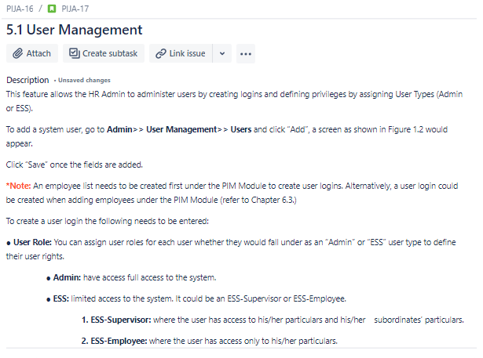

# Final project for IT Factory Manual Testing Course

The scope of the final project for ITF Manual Testing Course is to use all gained knowledge throught the course and apply them in practice, using a live application. 

Application under test: https://opensource-demo.orangehrmlive.com/

API Documentation: https://orangehrm.github.io/orangehrm-api-doc/

The final project will be split into 2 sections: Testing section and SQL section.

Tools used: JIRA, Zephyr Squad, Postman, MySQL Workbench.

# Functional specifications

The below Story was created in JIRA and describes the functional specifications of the Dependants module, for which the final project is performed upon.

# 1 Testing section

## 1.1 Test Planning

The Test Plan is designed to describe all details of testing for the Admin module from the OrangeHRM application.

The plan identifies the items to be tested, the features to be tested, the types of testing to be performed, the personnel responsible for testing, the resources and schedule required to complete testing, and the risks associated with the plan.

